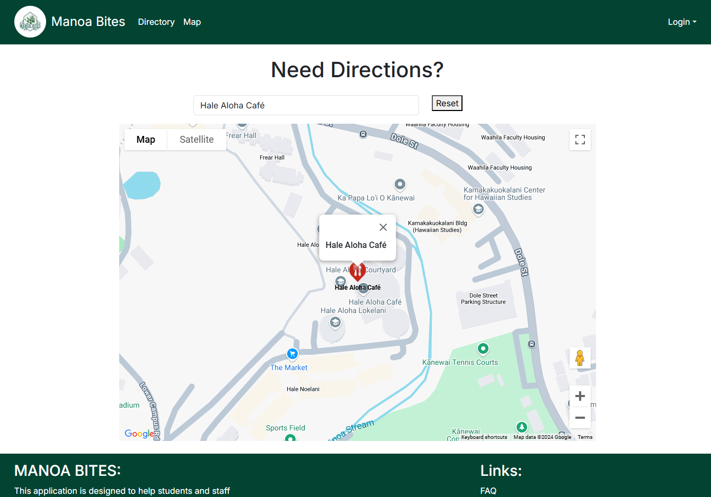

<h2>Introduction</h2>

For the most part of my journey majoring in Computer Science, AI was forbidden, never to be used. Even in my non-computer science classes AI is greatly frowned upon and has severe consequences if used. So when I walked into my ICS 314 class for Software Engineering and one of the first things professor Moore said was "It's okay if you use AI! Just make sure you say so when you submit your assignments," I honestly could not believe it and thought it was a test. At first I was very reluctant on using AI because I wanted to prove myself of being capable of doing everything on my own. That changed when the pace of this class started picking up.

<h2>My Personal Experience With AI</h2>

<h4>WODs</h4>

For ICS 314, there was a good amount of the semester where all we were doing were "Workout Of The Day"(WODs). It is a timed praticum that was based off the material assigned to us previously. One would have to complete the neccesary requirements under a certain amount of time in order to pass. Some of our assignments were Experience WODs which mimick what our real in-class timed WOD would look like. For these assignments in particular, I would not use AI since we were allowed to try as much times as needed and time was not a grading factor. There were also walk through videos that accompanied these Experience WODS that would give you one example of how to complete it from start to finish so there were even less reasons to use AI. When doing things at my own pace, I know I can for the most part get it done but I might take a long time. So when it came to in-class practice WODs and the real WODs, AI was my bestfriend. For things that required a lot more function coding, AI really helped me as I am not the biggest fan of back-end engineering. I would still for the first half on my own but when time was almost out, I did rely on ChatGPT to save me. For some WODs, I feel like it did more harm than good. I remember trying to use ChatGPT on a WOD but I was getting so much ESLint errors that I did not know how to fix, I eventually ran out of time to finish it. When it came to our UX/UI WODs I would use AI to help me format things correctly if it wasn't centered how I needed it to be, though for the most part I would refer to practice WODs for methods or use the page inspector to figure out why my elements were formatted off.

<h4>Final Project</h4>

When it came to our final project, ChatGPT did come in clutch for me. A lot of the functionality needed for the application we were developing were beyond my capabilities and as mentioned earlier, back-end design is probably my biggest weakness. So yes, for this project I did ask ChatGPT to help me out. Near the end of the project I also discovered a different AI generator called <a href="https://myninja.ai/">NinjaTech.AI</a> and I felt like this produced better quailty code compared to what I would get from ChatGPT.

<h4>Using AI to Fix Code</h4>

For the most part, when it came to fixing code I tried to stay away from using AI. This is because sometimes it would not resolve the issue and make things more complicating to fix. Copilot on VSCode only could do so much, and if the AI system is not aware of your data setup, it can steer you in the wrong direction. When fixing ESLint errors I typically can resolve it on my own since it explains to you what is wrong or I click on the link to "show documentation" where it will describe in more depth what is wrong with the code and what is the correct sytnax for the specific code.

<h4>Writing with AI</h4>

Every single essay I have written on my own. I may not be the best writer but I know that it sounds more authentic when I write it myself. Using AI takes out the personality, tone, and individuality. It terms of writing/explaining/documenting code, that is also something I can easily do on my own.

<h4>Educational Resources</h4>

When it came to finding additional resources to aid me in this class I did not use AI. Personally, I really enojyed practing on my own and the resources given to us on <a href="https://www.codecademy.com/">CodeAcademy</a> and <a href="https://www.freecodecamp.org/news/">freeCodeCamp.org</a>. I appreciate the very thourough walk-throughs and demostrations on these websites.

<h2>Impact on Learning and Understanding:</h2>

AI has been helpful in many ways. Personally, I am the type of person who learns better after seeing how something is supposed to be done a few times as words don't always translate well for me. Though after using it a few times to get the hang of certain concepts, I find that I am more capable of doing it on my own. Sometimes my original solution requires hundreds of lines of coding but AI can show me a way that is more efficient.

<h2>Pratical Applications</h2>

As mentioned earlier, AI was a real key player for our final project. Whatever vision I had, AI could bring it to life. For example, originally our Map page for our application showed every single restaurants map marker. I thought it looked really messy so I wanted it to show the main Locations on Campus and then allow a user to select a specific restaurant then render only that restaurants' map marker.

  

    <h4>Before AI:</h4>
     
  

  

    <h4>After AI:</h4>
     
    
  

<h2>Challenges and Opportunities</h2>

When working with databases, sometimes AI does not generate the correct code if it does not know how your models are set up. Though, it can help you get a general idea of what might be wrong with your current code. With AI the sky really is the limit. Though with software engineering education I don't feel like it should be something we should heavily rely on as when it comes to job interviews, I am pretty confident that most interviewers wouldn't like to see us use AI to generate code.

<h2>Comparative Analysis</h2>

AI can definitely get anyjob done when you provide the right information and context. Though how much of it do we actually retain? Personally, I do know how to do a lot of the basic stuff needed but I will jump to AI to help with more complex tasks. It did allow us to get through a lot more concepts faster but I can't say I have been able to fully understand and grasp everything. Compared to other classes that don't allow AI, I guess its better to be able to figure out the solution that to not know at all.

<h2>Future Considerations</h2>

The biggest challenge I think that will come from further integration of AI in software engineering education is that students won't actually know what they're doing. This is something I see in myself. Though I understand how the code works, if you asked me to build an application completely from scratch without using AI, I'm pretty sure it won't be as intricate than if I were to use AI. Regardless, I believe that over time and with more self-practice I can become more efficient in my skills and my dependency on AI will decrease.

<h2>Conclusion</h2>

AI is like Google on steriods. It does all the searching for you and returns a result that best solves the prompt you give it. Rather than me going through many different sources and sites for a solution, it brings it all to one place and saves me so much time. Would I say I have learned nothing even though we were allowed to use AI? Absolutely not. AI has given me more tools that we may not have covered in class to create and do more. AI is not always the complete answer but it is definitely a crutch and fills the gaps in which our knowledge may be lacking.

