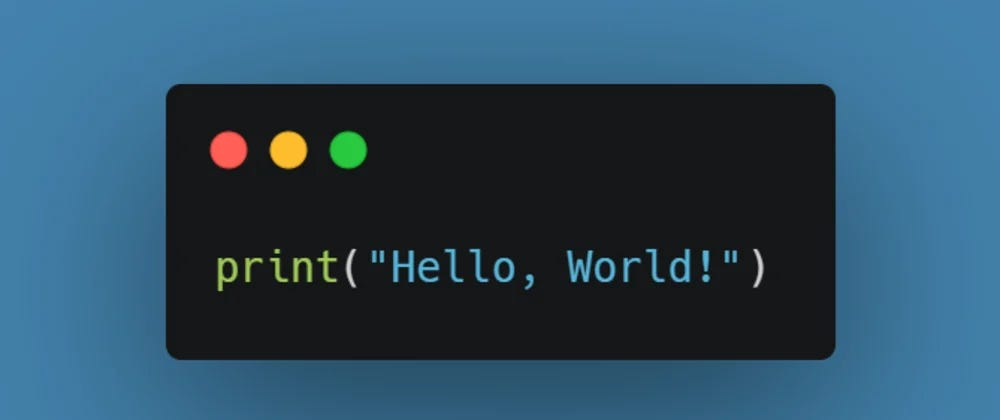

<div>
<div class="mx-auto">

</div>
<h2>"Hello World"</h2>
<p>Hello world of software engineering! A world of endless possibilities and outcomes. Everything I have studied up until this point has barely even prepared me for the work needed to be done. Taking my first software engineering class I honeslty did not know what to expect. Every class so far has just been going over basic coding in different languages and on different IDE's. Every day was filled with new challenges, lessons to be learned, and skills to gain.</p>

<h3>Finding My Niche</h3>
<p>Personally, when I first started this class I figured it would be more focused on back-end design and coding. Truthfully, that didn't excite me much. Though after the first half of the semester, we started to get into UI Frameworks. UI Frameworks has been one of my favorite topics to learn about and has given me clarity on what I would want to do after finishing school. UI Frameworks are designed to make application design easy and consistent through different browsers and devices. In this class specifically, we used React-Bootstrap. Using a framework saves you so much time compared to trying to develop a web page completely from scratch. React-Bootstrap did give me a great introduction into what is a UI Framework and how to use them. In terms of using these skills and knowledge outside of class, I plan on working on side projects with React-Bootstrap to better hone my skills.</p>

<h3>Team Work</h3>
<p>Before this class, everything we did for any computer science class was done as an individual assignment. Working on a team to build an application was foreign to me but this class gave me the tools needed to make sure things were getting done. In this class, we were introduced to IDPM, Issue-Driven Project Management. It is an approach that allows us to keep track of tasks that needs to be done and keeps the project organized. With this approach, all work done for a specific task was done in a separate branch, then pushed into main when done. This allowed many people to be working on the project at the same time while preventing overwritting other peoples work. When asked to merged into main, if there are any discrepancies we looked over them before publishing our work, which I thuoght was neat. Also, when running into issues on finishing a task, another team member could easily look for our branch to see our progress and make adjustments as needed. Taking it a step further with effort estimation allowed us to better manage our time to ensure tasks were done by the deadline. IDPM is something I could see myself using on future team projects.</p>

<h3>Coding That Saves You Time</h3>
<p>Funcitonal programming saves you a lot of time and effort. Setting up your functions in a way that allow you to cut down the amount of code needed is the best part of it. For example, if you give an array of items, you can use .map in a function to print out all of them instead of trying to hard code them as shown below:

```
const names = ["Pelita", "Cam", "Al"]

const hiEveryone = names.map(name => `Hello ${name}`);

console.log(hiEveryone);

Compared to:

console.log("Hello + names[0], names[1], names[2]);
```

It makes your code more efficeint and allows it to be easier to scale. Functional programming is something we tried to use as much as we could in creating our final project. For example we had a data set of restaurants and mapped them to our component that would render a car displaying all of their information. This is a skill that is essential to any considering going into the Computer Science field and something I will take with me for the rest of my life. Why work harder when you can work smarter, right?
</p>

<h2>Conclusion</h2>
<p>This class has pushed me to my limits and I have become a better student for it. Growth definitely happens outside of your comfort zone and learning all these new things helped elevate my skills. The exposure to a new aspect of computer science allowed me to find something I enjoy which is UI design. Before this, data science/analysis was the direction that I was going in simply because I am naturally good with numbers. However, UI design has allowed me to tap into creatie side, giving me a sense of fufillment.</p>
</div>