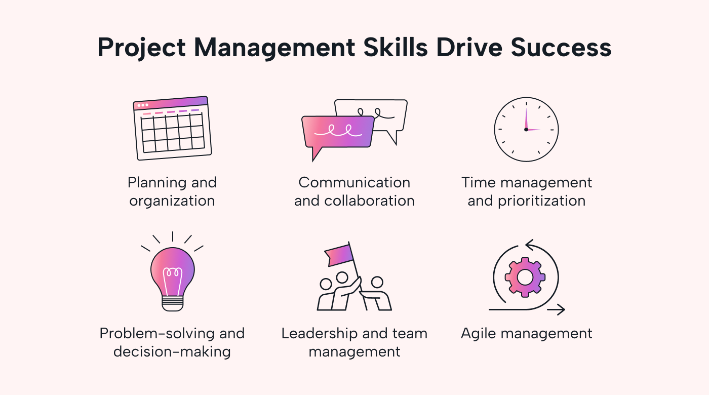

<Container>

<h2>What is IDPM and Effort Estimation?</h2>

IDPM stands for Issue-Driven Project Management. It is an approach to a project that allows for many people to work together and easily keep track of progress, due dates, and timelines. Incorporating effort estimation into an IDPM allows the team to determine how much work still needs to be done before a specific due date and how to divvy up their time. In IDPM, each tasks is typically done in a different branch keeping the work done organized. Having issues/tasks to do also help keeps track of who is working on what and if progress is being made by checking the branch that should correspond to the issue. Overall, I believe this type of project manangement is very helpful for mananging work in a team and makes sure everyone is on the same page.

<h2>My Personal Experience with IDPM and Effort Estimation</h2>

We were given this project manangement approach to use in our final project for ICS 314. During this time I used my iPhone to help keep track of my actual effort time. For my estimates, in the beginning I went solely based of wether this was something I did before in class and how comfortable I felt with this task. Even though some of my estimates were slightly off I felt like it was beneficial to me in a way that could help me better manage my time for a task thats similar. For example, early on in the project I thought I could make a form very easily because thats something we had done in the past, I actually went over my estimated time because for some reason it was not rendering on the link I wanted it to but it would locally. From this, I learned that running it locally might work but it won't always working when we try to deploy it to vercel and having to re-push into the main branch and then waiting for it to deploy would take more time. I started giving myself a bit more time for each issue to accomodate for this. Everytime I went over my estimation it gave me things to consider for my future tasks. When looking at the actual time it took it gave me a better idea of how early I should get on it in order to get everything done by our Milestone due date. As the project went on, I found a better sense of my strengths and weaknesses and the speed of my work which is very insightful when working on projects with specific timelines.

</Container>
