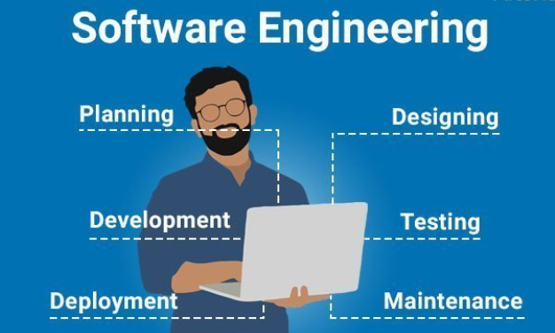

<figure class="float-end ps-4" style="max-width: 420px;">
  
  <figcaption style="font-size: 0.85rem;">
    <a href="https://artoftesting.com/software-engineering#google_vignette">
      Image Source
    </a>
  </figcaption>
</figure>

  <h2>Software Engineering II</h2>
  

    Having taken Software Engineering I in Fall 2024, I already knew that Software Engineering II was a class I really wanted to take. A friend of mine had taken the course in Spring 2025 and explained that their class launched an application for an actual customer. The scale of that project sounded intimidating, but also necessary to really push our skills and boundaries.
  

  

    When I started this semester and learned that there would not be an external customer, I was a bit disappointed, as having a real client would have made the experience feel more realistic. That being said, even having our professor act as the customer was still challenging. He consistently found areas where we could improve, adjust, or add new features, which pushed us to think more critically about our application.
  

  <h2>Teamwork</h2>
  

    In the first few weeks of the project, our team initially consisted of six to seven people, but eventually grew to a team of nine. At first, I assumed that having a larger team would make it easier to get more work done. Unfortunately, that was not the case. During the first few milestones, it felt like only about half of the team was actively contributing to the project.
  

  

    I made several attempts to encourage more participation from the rest of the team, but after repeated efforts with little change, I eventually became discouraged. Halfway through the semester, this made it difficult for me to stay motivated as well. I admit that I did slack off at times, but I made an effort to push myself again during the last few milestones. Despite these challenges, I am still proud of what our team was ultimately able to accomplish.
  

  <h2>Course Structure and Learning Experience</h2>
  

    Building this application was a significant challenge, and it highlighted how much of modern software development relies on tools and resources beyond what is traditionally taught in class. While our courses provide strong foundational knowledge, creating a full application like this often felt like something we had to figure out largely on our own. I personally would have liked to feel more confident building the project without relying so heavily on AI, especially as someone who hopes to enter the software engineering field.
  

  

    Having additional guidance or resources throughout the course could have made the learning experience feel more balanced. Additionally, I think assigning different types of projects to each group might have made the course more engaging and varied. Overall, despite its challenges, this course pushed me outside of my comfort zone and gave me a better understanding of what real-world software development can look like.
  

