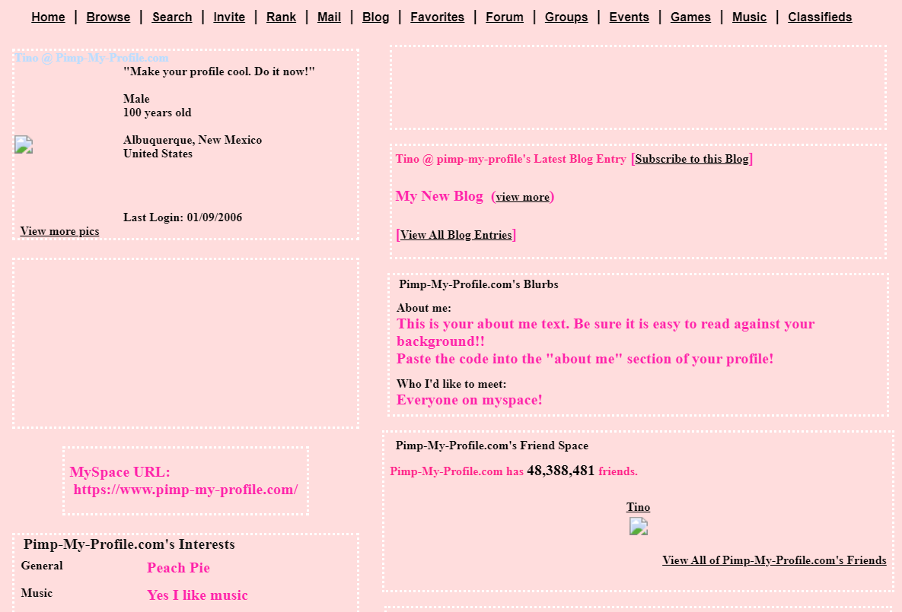

<h2>Turning Point in My ICS Journey</h2>

Coming back to school to study Information and Computer Sciences, I was initially set on a career in data science since math was one of my strongest skills. However, as I progressed with my studies, I began questioning my path. Where do I belong in the world of computer science? Then came UI and I was instantly taken back to 11-year-old me designing my profile page for MySpace.

  

<h2>My First Interactions With HTML</h2>
<a href="https://www.pimp-my-profile.com/layouts/preview.php?mode=myspace&cname=Pretty&layout_id=31259">
Click the image for a direct line to the template.
</a>

Before Twitter, Instagram, and Facebook, MySpace was the social website of its time. It wasn’t like any other website in the sense that you could design your own profile page via HTML. It was then I designed my first ever web page.  There were many HTML templates and resources online that you could use to help build your page and customize it. I remember spending hours finding HTML templates and tweaking it to my liking -setting my profile page background, cursor, and adding a music player to play my favorite songs. The possibilities were endless, and even though many profiles looked wild, they were filled with personality. 

  

    

<h2>Learning HTML Now</i></h2>
<a href="https://github.com/pelitaf/wod-aloha-beer">
Click here for a direct link to my repo of this recreation
</a>

Fast forward to now, learning about HTML/CSS and Bootstrap 5 feels like a full circle moment for me. Building a website from scratch with raw HTML and CSS code can be daunting and time consuming. However, Bootstrap 5 changes the game. Recreating Duke's Waikiki from scratch(my work pictured above) would probably take me hours, but Bootstrap 5 cuts down my time exponentially. It presets for cards, navbars, and more, which alleviates the workload of a web designer. Additionally, it ensures the websites I build are mobile-compatible, which is a must in today’s world.

<footer class="container align-items-center">
<h2>What Now?</h2>

After dipping my toes into UI design, I finally feel like I have a place in this industry. I’m excited to learn more about this field and see where it takes me. 

</footer>
