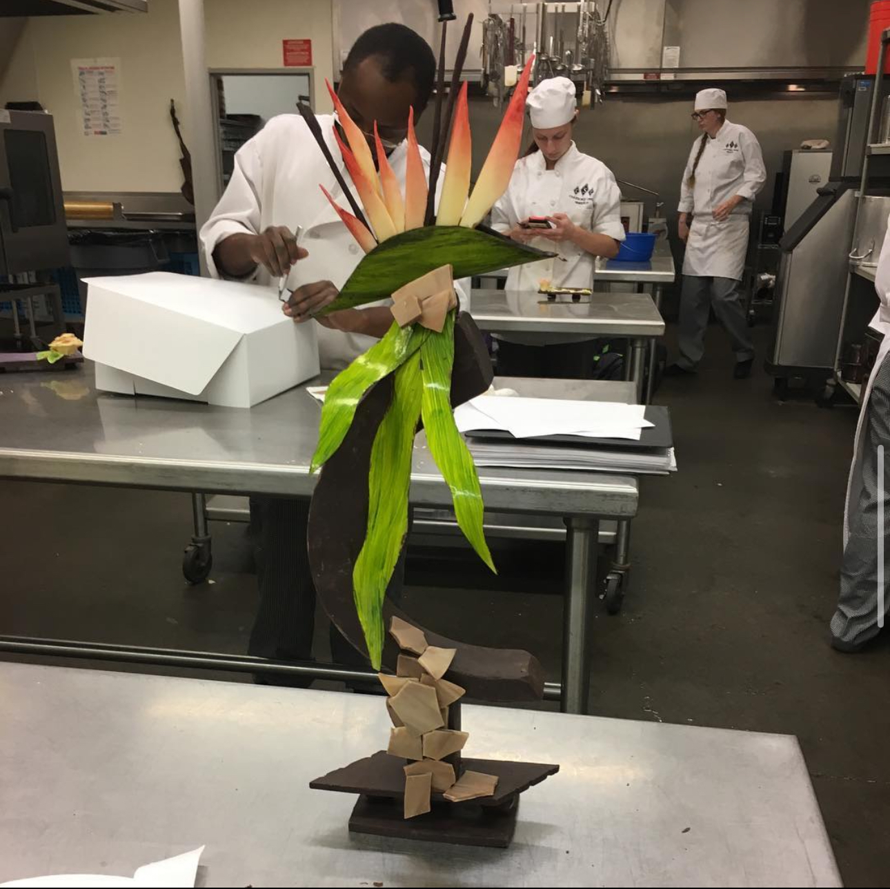

# Before Computer Science

In another lifetime, Baking and Culinary Arts has been everything I knew. After highschool, I went to college for Baking & Pastry Arts. In order to get more merit scholarships, I joined the Honors Program, which means I had to be enrolled in an honors class. Since there were no honors classes in this field, I had to coordinate with the Honors Program director and my instructor to create a project that would take my class to a "honors level." That brought me to create this entire sculpture myself at home with the tools and knowledge I had.

# The Process
I bought about three pounds of chocolate and colored cocoa butter. To make the base of the sculpture, I had to create my own molds out of paper. I then tempered the chocolate and poured it into my self-made molds. For the flowers I used acetate and the cocoa butter. I painted the cocoa butter onto the acetate first, then poured tempered white chocolate onto it. I then set the acetate onto a paper towel roll so that when it set, it would hold its shape. To assemble all the pieces together, I used small amounts of chocolate, and let it set in the fridge section by section.

# Reflection
This project definitely challenged me in many ways. My biggest problem was doing this at home and not in a professional kitchen, lacking the equipment and space. I perservered and found alternative ways to problem solve. For example, typically cocoa butter is airbrushed onto chocolate pieces to give it color. I did not have the resources for it, so instead I figured to brush it onto the acetate first since chocolate will also pick up transfers.
