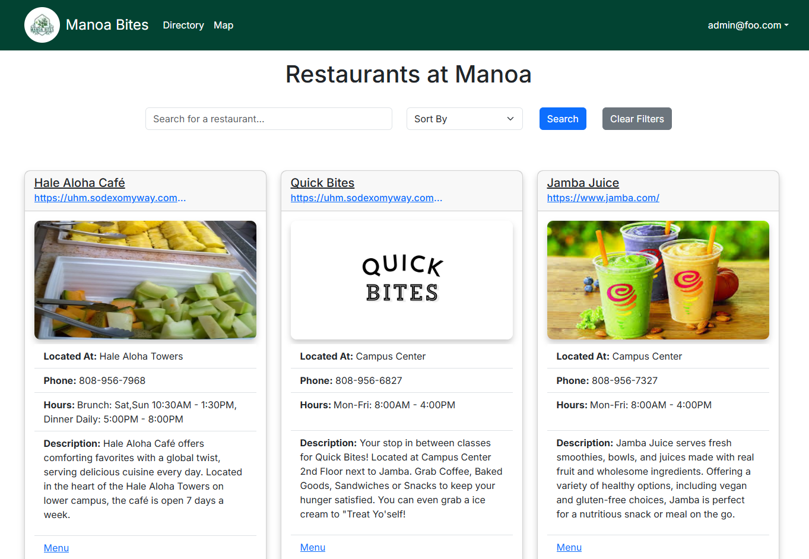

Manoa Bites is a web application that I helped create as a team project in ICS 314, Fall 2024. This project gave me hands on experience on creating a responsive web site with other people.

Manoa Bites is deployed using [Vercel](https://vercel.com/). Over the course of approximately 5 weeks, we created this website catered to people who frequent the UH Manoa campus who are looking for a place to eat. The website displays restaurants information on the home page. If users create an account they can also "favorite" restaurants and view the ones they have saved. The admin user can edit, delete, and add restaurant information. Vendors can also sign-up to add their restaurant onto our website and can only make edits to their our restaurant.

In order to build this website we used typscript codes and functions, [Postgres](https://www.postgresql.org/) for our database, and [React-Bootstrap framework](https://react-bootstrap.github.io/) to help make components. I was able to gain knowledge on how to create an application that can send information to our database and how to retrieve the information from the database. With the use of React-Bootstrap we were also able to implement components that had functionality. All of the back-end programming was done in typescript which foreced us to think critically and pushed us beyond our comfort zone of basic coding.

Working on a team to build this application was very insightful as well. We were provided an IDPM(Issue-Driven Project Management) approach that allowed us to organize our tasks and timelines. This helped the team stay on top of things and have clarity of what work is done, still needed, or in progress. For Software Engineering 1 students I am very pleased with our application we have built and can be viewed here at <a href="https://manoa-bites.vercel.app/">Manoa-Bites.vercel.app/</a>. 

 
Source: <a href="https://github.com/manoa-bites">Manoa Bites</a>
