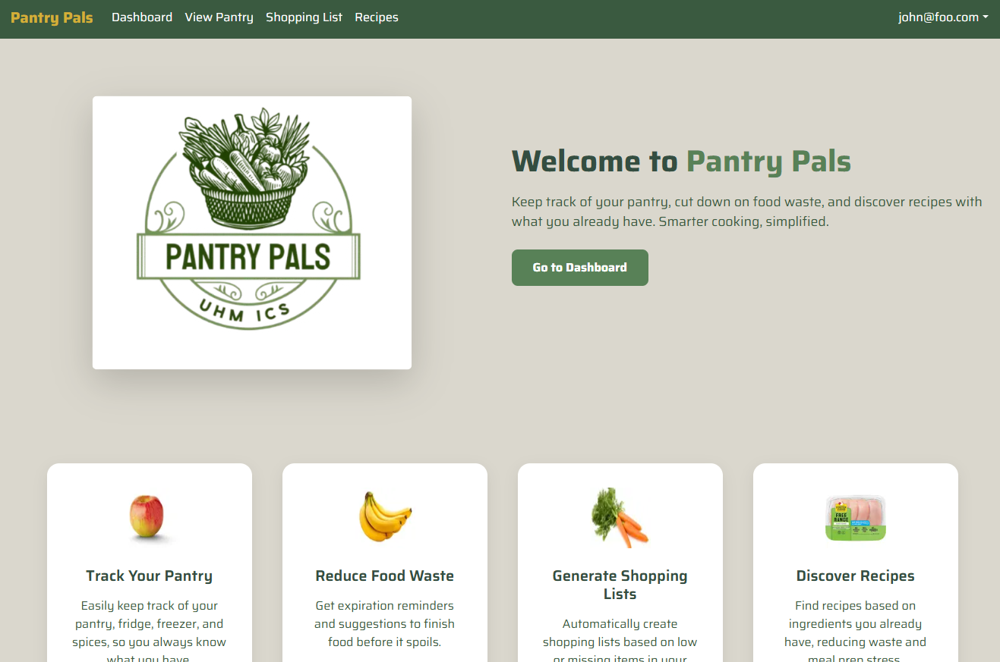

Pantry Pals is a web application I helped develop as a team project for ICS 414 during the Fall 2025 semester. Our team consisted of nine members with varying skill levels, backgrounds, and work styles. We worked on this project throughout the entire semester, iterating on features, UI design, and database structure.

The purpose of Pantry Pals is to help users stay organized with the food they have at home. Users can add pantry items with details such as quantity, storage location, type, and expiration date. The app highlights expiring items, making it easier for users to prioritize what to use before food goes to waste.

Pantry Pals also allows users to generate and manage grocery shopping lists based on missing or low-stock items. Items can be added individually or in bulk, helping streamline grocery planning. The application supports editing and deleting pantry items, as well as updating quantities as food is used.

The application is built using TypeScript and React, with [Postgres](https://www.postgresql.org/) as the database and [React-Bootstrap](https://react-bootstrap.github.io/) for UI components. Pantry Pals is deployed using [Vercel](https://vercel.com/). We focused on creating a clean, user-friendly interface while maintaining reliable data handling on the backend.

To manage team productivity and collaboration, we used GitHub Projects to track tasks, assign issues, and monitor progress throughout the semester. This helped keep the team aligned and ensured features were completed in a structured and timely manner.

Working on Pantry Pals strengthened my experience with full-stack development and team collaboration in a real-world project setting. It was a valuable learning experience that combined technical implementation with thoughtful UI design.

 
Source: <a href="https://pantry-pal-gamma.vercel.app/">Pantry Pals</a>
